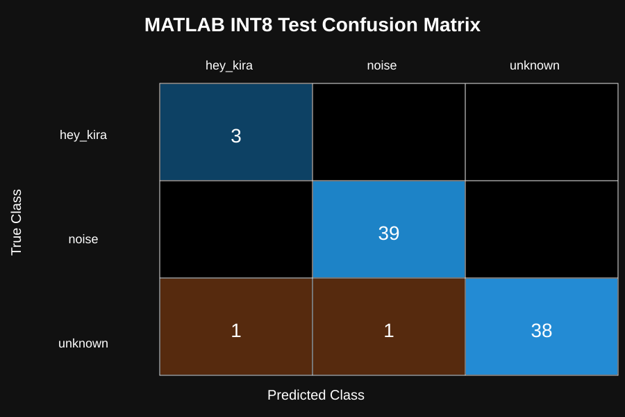
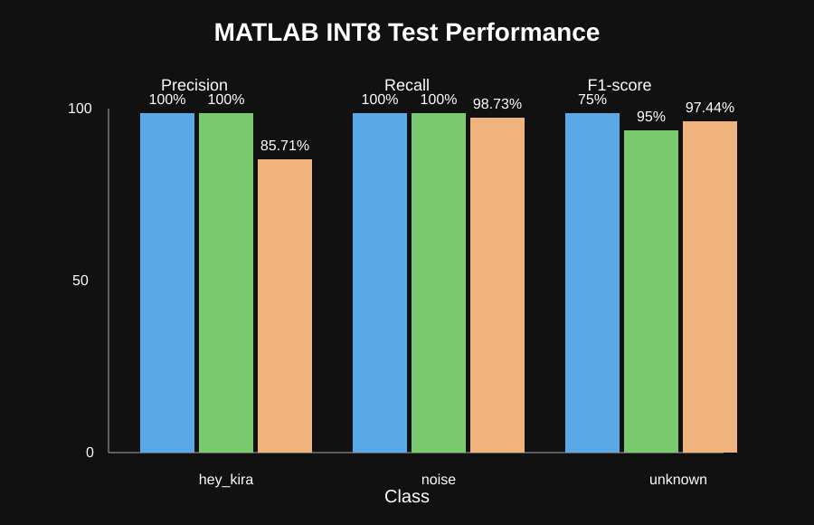
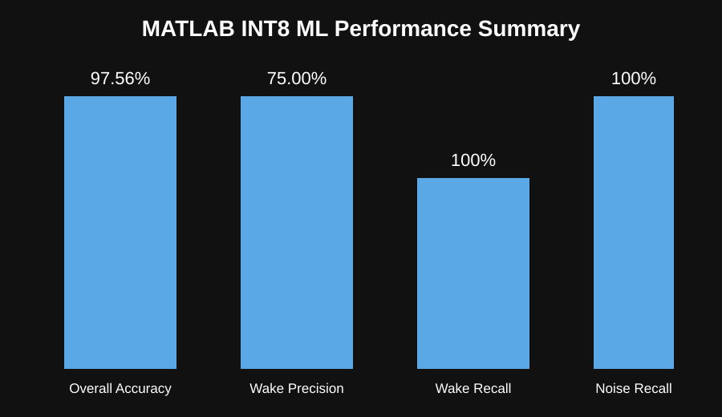
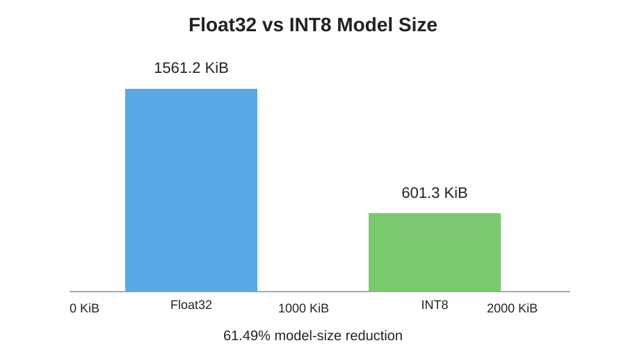
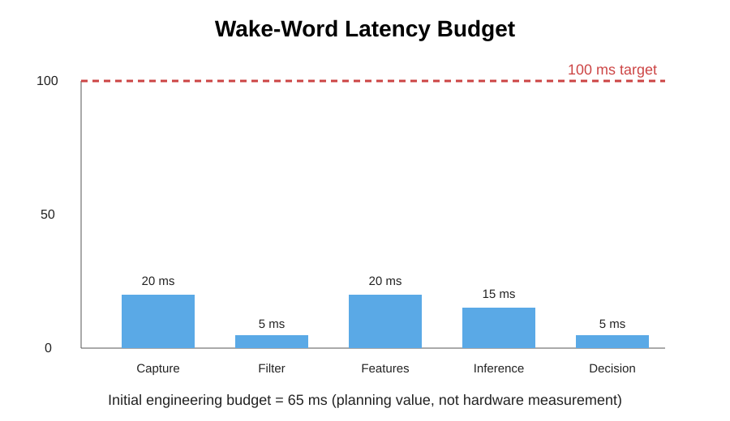
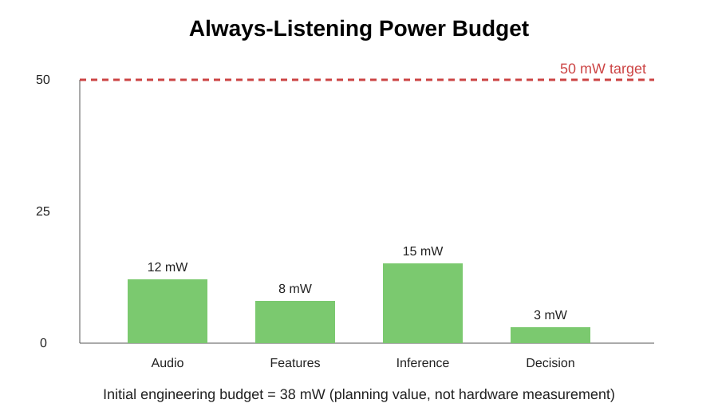

# SIH26172 – Low-Latency and Efficient Voice Activator for Edge Devices

Smart India Hackathon 2026 – Problem Statement PS26172.

## Project objective
Build a real-time, resource-efficient voice activation layer for edge devices. The proposed system performs custom wake-word detection locally on a microcontroller and starts audio streaming only after a confident trigger.

## Proposed architecture


The architecture separates the **always-listening edge stage** from the **triggered server stage**. Audio is captured locally, processed through lightweight preprocessing and feature extraction, classified with an INT8 TinyML model, and only after a confident wake-word decision is the subsequent audio streamed to the remote ASR service.

## Current ML status
The current Edge Impulse export uses three classes:

- `hey_kira` – wake word
- `noise` – environmental noise
- `unknown` – other speech/non-target audio

### Validation result
- Accuracy: **98.22%**
- Weighted precision: **98.25%**
- Weighted recall: **98.22%**
- Weighted F1-score: **98.17%**
- ROC-AUC: **99.27%**
- Validation samples: **169**

### Independent test result reproduced in MATLAB
- Test samples: **82**
- Correct predictions: **80**
- Incorrect predictions: **2**
- Accuracy: **97.56%**

Test confusion matrix:

| Actual / Predicted | hey_kira | noise | unknown |
|---|---:|---:|---:|
| hey_kira | 3 | 0 | 0 |
| noise | 0 | 39 | 0 |
| unknown | 1 | 1 | 38 |

Wake-word test metrics:
- Precision: **75.00%**
- Recall: **100.00%**
- F1-score: **85.71%**

## MATLAB validation outputs
The current exported INT8 model was loaded and evaluated in MATLAB. The 82-sample independent test set reproduced the reference test result: **80/82 correct (97.56%)**.

### Confusion matrix


### Precision, recall and F1-score


### ML performance summary


## INT8 optimization
The exported model files currently available for analysis show:

- Float32 model size: **1561.2 KiB**
- INT8 model size: **601.3 KiB**
- Model-size reduction: **61.49%**

This is a model-size result, not a measured power reduction.

### Model-size visualization


## Latency and power analysis
The following figures are **initial engineering budgets**, not measured ESP32-S3 hardware results.

### Wake-word latency budget


The current planning budget allocates 65 ms against the 100 ms target. Final end-to-end latency must be measured on the physical ESP32-S3.

### Always-listening power budget


The current planning budget allocates 38 mW against the 50 mW target. Final board-level power must be measured on the physical ESP32-S3.

## Performance targets
These are project targets and will be validated on the physical ESP32-S3 prototype:

- Wake-word detection latency: **<100 ms**
- Noisy-environment accuracy: **>90%**
- Always-listening average power: **<50 mW**
- Customizable wake word support

## MATLAB analysis
The `matlab/` directory contains scripts for:

- Confusion matrix analysis
- Precision, recall and F1-score
- Wake-word specific analysis
- Noise robustness
- Float32 vs INT8 model-size comparison
- Latency budget analysis
- Power-budget analysis
- Final performance summary

The `results/matlab/` directory contains the corresponding visualization outputs.

Hardware latency, CPU, RAM, power and false-activation/hour measurements are intentionally marked as pending until ESP32-S3 validation is completed.

## Repository structure
```text
.
├── docs/
│   └── proposed-system-architecture-new.png
├── firmware/
├── edge_impulse/
├── matlab/
├── results/
│   └── matlab/
├── tests/
├── data/
└── README.md
```

## Data and model files
Large binary assets such as `.npy`, `.mat`, `.lite`, H5 and SavedModel exports should be stored using Git LFS or an appropriate release/artifact store when the team is ready. Sensitive/private audio should not be committed.

## Development philosophy
Build and verify each stage independently:

1. Hardware bring-up
2. Microphone capture
3. Buffering and feature pipeline
4. Model validation
5. INT8 optimization
6. Embedded deployment
7. Wake-word decision logic
8. Streaming and ASR
9. Latency/power benchmarking
10. Final validation and documentation

## Status
**Current stage:** Edge Impulse model exported and independently reproduced in MATLAB on the 82-sample test set. Physical ESP32-S3 validation is next.
